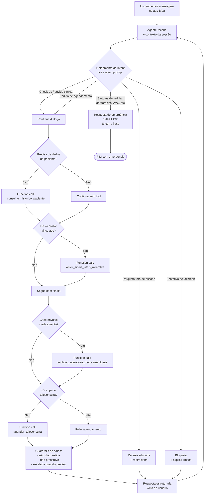

# Arquitetura do BluaDiagnostics

Este fluxograma representa o caminho que uma mensagem do usuário percorre
dentro do agente. Está em Mermaid porque o GitHub renderiza nativamente
- quem abrir o arquivo no GitHub vê o diagrama, não o código.

## Fluxo completo

## Legenda dos blocos

- **Roteamento de intent**: o próprio LLM faz a classificação, guiado
  pelo system prompt. Não temos um classificador separado nesta sprint.
- **Function call**: usa o function calling nativo do Gemini 2.5 Flash.
  O modelo decide quando chamar a tool baseado na descrição que a gente
  colocou no `tools_spec.json`.
- **Tool de wearable (bônus)**: simula integração com Apple Health,
  Google Fit ou Oura. Os dados vêm de `data/wearables_mock.json`.
- **Guardrails de saída**: aqui dá pra (futuramente) ter uma camada
  extra de validação, por exemplo, regex/LLM judge verificando se a
  resposta contém alguma frase tipo "você tem [doença X]". Na PoC, a
  primeira linha de defesa é o próprio system prompt.

## Decisões de arquitetura registradas

1. **Sem classificador separado.** A gente avaliou usar um modelo
   pequeno só pro roteamento de intent (mais barato), mas pra uma PoC
   isso adiciona complexidade desnecessária. O Gemini 2.5 Flash já é
   rápido e barato o suficiente pra fazer o trabalho todo.

2. **Tools são mockadas.** Isso é intencional: o objetivo aqui é validar
   a *forma* da chamada (function calling estruturado), não a integração
   real com sistemas Care Plus. Em produção, cada função vira uma
   chamada HTTP autenticada.

3. **Memória só de sessão.** A gente não persiste conversa em banco
   nesta sprint. A memória existe enquanto o objeto `chat` viver no
   notebook. Persistência de histórico cross-sessão é decisão de produto
   (e tem implicação de LGPD pesada), então fica pra depois.

4. **Escalada humana é caminho preferencial em dúvida.** Sempre que o
   bot tiver qualquer incerteza, a resposta padrão é "vamos te conectar
   com um médico". Nunca "acho que pode ser X".

5. **Wearables como sinal complementar, nunca decisor.** Mesmo que a
   tool de wearable devolva FC ou SpO2 fora do normal, a conduta segue
   o caminho normal de triagem + escalada. A gente não deixa o bot
   "diagnosticar" com base em sinal de sensor doméstico.

6. **Rate limiting client-side.** O free tier padrão do Gemini 2.5
   Flash é de 5 RPM (1 chamada a cada 12s). A conta da PoC tá com
   crédito de teste no Tier 1, mas o notebook mantém `time.sleep(7)`
   entre chamadas e retry exponencial como margem, se alguém do grupo
   rodar com chave sem crédito, continua funcionando.
